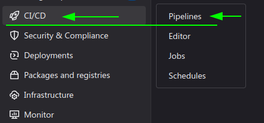

# BugBounty Gitlab Pipelines

# How to use them
* Create a **New** private gitlab group (no subgroup) (ie `RANDOM-hash`) (This will make sure you dont run out of gitlab runner time on your other groups)
* Create a private project under the new group ie `program-name`
* Rename the `pipelines` folder into `.pipelines` and place under your gitlab project root directory
* Rename `dot-gitlab-ci.yml` into `.gitlab.-ci.yml` and place under your gitlab project root directory
* Create a file `domains.list` with your inscope domains
* When the pipeline is started from the web you can bypass certain default settings by passing the following variable from the Gitlab web interface
  * `DOMAINS_LIST`: The file holding the inscope domains (default: `domains.list`)
  * `THREADS`: The limit to the threads that will be applied on those tools that support it (default: `3`)
  * `RATE_LIMIT`: The rate limit to be applied on those tools that support it (default: `5`)
  * `CSP_BASE`: A keyword to search for when we run `cspparse` (default: `example`)
* Commit and push your changes and watch the pipeline run

## stages
The current pipeline has the following stages
  - `initialization`: For preparing the environment
  - `info_gathering:passive`: For passive scans
  - `info_gathering:active`: For active non aggressive scans (ie GET, or ping a host etc)
  - `infogather_aggregation`: For aggregating the results from all the preceding jobs and for providing an intermediate stage to download all the results
  - `scanning`: Perform more aggressive scans, fuzzers, port scanners and other automated enumerators (ie bbot)
